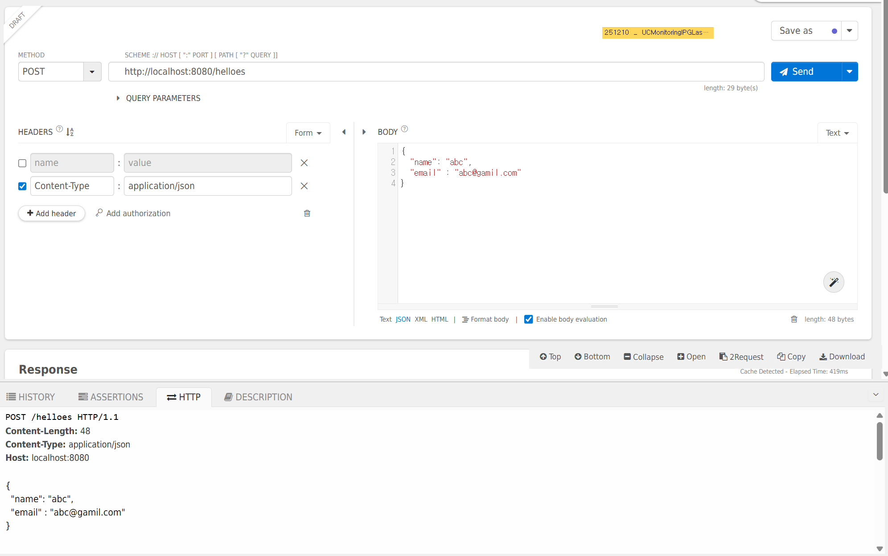
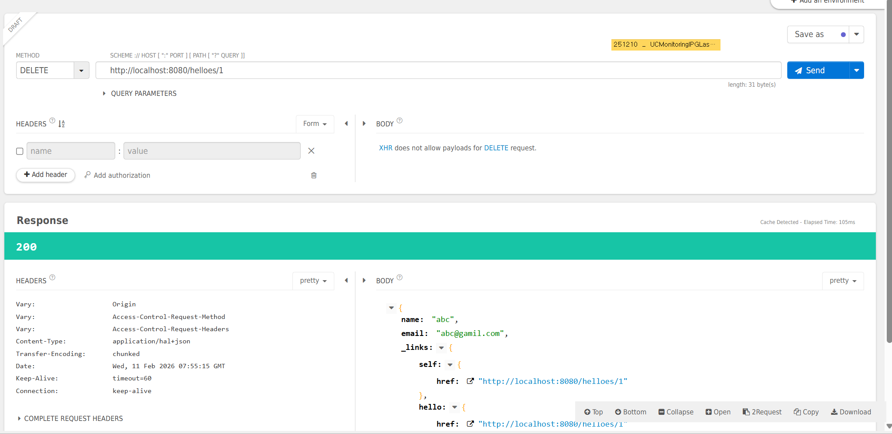

### springboot의 jpa에 따른 coc 원칙으로 생성된 uri는 Helloes네요 ?! 에 따른 답변

Spring Data REST라는 라이브러리가 영어 복수형 규칙을 적용할 때 '자음 + o'로 끝나는 단어 뒤에 'es'를 붙이는 기본 문법 규칙을 아주 기계적으로 따랐기 때문에 발생한 현상입니다.
#### 🧐 왜 helloes가 되었을까요?
Spring Data REST는 엔티티 이름(Hello)을 기반으로 복수형 URI를 자동으로 생성하는데, 이때 내부적으로 사용하는 Evo Inflector 같은 라이브러리가 영어의 일반적인 복수형 규칙인 $자음 + o \rightarrow es$를 적용해 버린 것입니다.

컴퓨터의 논리: Potato → Potatoes, Hero → Heroes니까, Hello도 Helloes겠지?

우리의 상식: 하지만 Hello는 외래어적 성격이 있어 Hellos가 훨씬 자연스럽습니다.

#### 🛠️ 해결 방법 (폴더 이름과 맞추기)
도연님의 폴더 이름인 hellos와 일치시키고 싶다면, @RepositoryRestResource 어노테이션을 사용하여 수동으로 경로를 지정해 주면 됩니다.

Java

import org.springframework.data.jpa.repository.JpaRepository;
import org.springframework.data.rest.core.annotation.RepositoryRestResource;

// path 속성을 사용하여 원하는 URI를 직접 지정합니다.
@RepositoryRestResource(collectionResourceRel = "hellos", path = "hellos")
public interface HelloRepository extends JpaRepository<Hello, Long> {
}
이렇게 수정하고 다시 실행하면 JSON 결과의 링크가 helloes가 아닌 **hellos**로 예쁘게 바뀔 거예요.

#### 💡 정리하자면
현재 상황: 스프링의 자동화 기능(CoC)이 영어 문법의 '일반 규칙'을 너무 성실하게 지켜서 발생한 일입니다.

해결책: 관례(CoC)보다 개발자의 의도가 우선이므로, 어노테이션으로 이름을 명시해주면 끝납니다!

폴더 이름(Hellos)을 바꾸실 필요 전혀 없습니다. 도연님이 생각하신 Hellos가 언어적으로 더 자연스러운 게 맞으니까요!

수정된 어노테이션을 적용해 보시겠어요? 혹시 적용 중에 임포트 에러가 나면 바로 말씀해 주세요!

## 관련 정보 요약:

엔티티 명칭: Hello

자동 생성 URI: helloes (복수형 규칙 자동 적용)

사용자 선호 명칭: hellos

해결 방법: @RepositoryRestResource(path = "hellos") 사용

## Talend API Tester 로 만든 Hellos 에 데이터 날려보기 
### 1. POST http://localhost:8080/helloes

```
Hibernate: 
    call next value for hello_seq
Hibernate: 
    insert
    into
        hello
        (email, name, id)
    values
        (?, ?, ?)
2026-02-11T16:50:51.510+09:00 TRACE 10020 --- [example1] [nio-8080-exec-9] org.hibernate.orm.jdbc.bind              : binding parameter (1:VARCHAR) <- [abc@gamil.com]
2026-02-11T16:50:51.510+09:00 TRACE 10020 --- [example1] [nio-8080-exec-9] org.hibernate.orm.jdbc.bind              : binding parameter (2:VARCHAR) <- [abc]
2026-02-11T16:50:51.510+09:00 TRACE 10020 --- [example1] [nio-8080-exec-9] org.hibernate.orm.jdbc.bind              : binding parameter (3:BIGINT) <- [1]
```

### 2. GET  http://localhost:8080/helloes


```
Hibernate: 
    select
        h1_0.id,
        h1_0.email,
        h1_0.name
    from
        hello h1_0
    offset
        ? rows
    fetch
        first ? rows only
2026-02-11T16:53:51.813+09:00 TRACE 10020 --- [example1] [nio-8080-exec-4] org.hibernate.orm.jdbc.bind              : binding parameter (1:INTEGER) <- [0]
2026-02-11T16:53:51.813+09:00 TRACE 10020 --- [example1] [nio-8080-exec-4] org.hibernate.orm.jdbc.bind              : binding parameter (2:INTEGER) <- [20]


```

### 3. DELETE  http://localhost:8080/helloes/1

```
Hibernate: 
    delete
    from
        hello
    where
        id=?
2026-02-11T16:55:15.883+09:00 TRACE 10020 --- [example1] [nio-8080-exec-8] org.hibernate.orm.jdbc.bind              : binding parameter (1:BIGINT) <- [1]
```