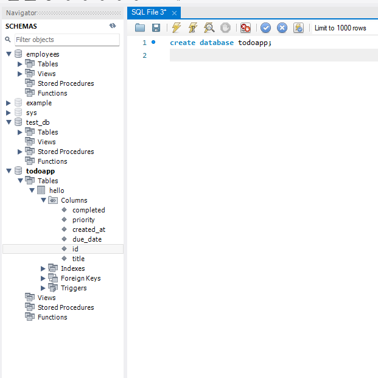

# StudySpringBoot
StudySpringBoot - SpringBoot 학습 내용 정리 공간 
# 의존성 코드 추가하고 다시 클린 후 의존성 설치할 때 -U 강제로 수정사항있으면 설치 
mvn clean install -U

# mysql 포트 3307 
# 사용 db : todoapp




### Table이 연결된 db에 자동 생성된 것을 확인할 수 있다
``` 
2026-02-12T12:06:29.589+09:00  INFO 16868 --- [todoapp] [  restartedMain] org.hibernate.orm.connections.pooling    : HHH10001005: Database info:
        Database JDBC URL [Connecting through datasource 'HikariDataSource (HikariPool-8)']
        Database driver: undefined/unknown
        Database version: 8.4.8
        Autocommit mode: undefined/unknown
        Isolation level: undefined/unknown
        Minimum pool size: undefined/unknown
        Maximum pool size: undefined/unknown
2026-02-12T12:06:29.610+09:00  INFO 16868 --- [todoapp] [  restartedMain] o.h.e.t.j.p.i.JtaPlatformInitiator       : HHH000489: No JTA platform available (set 'hibernate.transaction.jta.platform' to enable JTA platform integration)
Hibernate: 
    drop table if exists hello
Hibernate: 
    create table hello (
        completed bit not null,
        priority integer,
        created_at datetime(6),
        due_date datetime(6),
        id bigint not null auto_increment,
        title varchar(255) not null,
        primary key (id)
    ) engine=InnoDB

```

### UI 
Spring Boot에서 가장 빠르고 간편하게 UI를 만드는 방법은 Thymeleaf(타임리프) 템플릿 엔진을 사용하는 것입니다. 현재 pom.xml에 이미 Thymeleaf 의존성이 있으므로 바로 진행할 수 있습니다.

1. 정적 리소스 입구 만들기 (index.html)
스프링 부트는 src/main/resources/templates 폴더에서 화면 파일을 찾습니다. 여기에 index.html 파일을 만드세요.

파일 경로: src/main/resources/templates/index.html

HTML

<!DOCTYPE html>
<html xmlns:th="http://www.thymeleaf.org">
<head>
    <meta charset="UTF-8">
    <title>My ToDo App</title>
    <link href="https://cdn.jsdelivr.net/npm/bootstrap@5.3.0/dist/css/bootstrap.min.css" rel="stylesheet">
    <style>
        .completed { text-decoration: line-through; color: gray; }
    </style>
</head>
<body class="container mt-5">
    <h2 class="text-center mb-4">📝 My Todo List</h2>

    <div class="input-group mb-3">
        <input type="text" id="todoTitle" class="form-control" placeholder="할 일을 입력하세요...">
        <button class="btn btn-primary" onclick="addTodo()">추가</button>
    </div>

    <table class="table table-hover">
        <thead class="table-light">
            <tr>
                <th>상태</th>
                <th>할 일</th>
                <th>우선순위</th>
                <th>관리</th>
            </tr>
        </thead>
        <tbody id="todoList">
            </tbody>
    </table>

    <script>
        // 나중에 API 연결 시 사용할 자바스크립트 공간
        function addTodo() {
            const title = document.getElementById('todoTitle').value;
            alert('입력하신 내용: ' + title + '\n이제 Controller와 연결해 데이터를 저장할 차례입니다!');
        }
    </script>
</body>
</html>
2. 화면을 보여줄 Controller 연결
아까 만든 HelloController가 HTML 파일을 응답하도록 수정해야 합니다.
주의: @RestController는 문자열 자체를 반환하므로, HTML 파일을 보여주려면 **@Controller**를 사용해야 합니다.

파일 경로: src/main/java/com/example/todoapp/Helloes/HelloController.java

Java

package com.example.todoapp.Helloes;

import org.springframework.stereotype.Controller; // RestController 대신 Controller 사용
import org.springframework.web.bind.annotation.GetMapping;

@Controller
public class HelloController {

    @GetMapping("/")
    public String index() {
        // templates/index.html 파일을 찾아서 보여줍니다.
        return "index"; 
    }
}
3. 동작 확인
서버를 재시작하세요: ./mvnw spring-boot:run

브라우저에서 http://localhost:8080/ 에 접속합니다.

아래와 같은 깔끔한 ToDo 리스트 화면이 나오는지 확인하세요!

4. 소프트웨어 엔지니어를 위한 다음 단계 추천
화면(UI)까지 나왔으니 이제 실제 기능을 연결할 차례입니다. 어떤 기능을 먼저 구현해보고 싶으신가요?

Create: 입력창에 글을 쓰고 '추가'를 누르면 MySQL의 hello 테이블에 실제로 저장하기

Read: DB에 저장된 할 일 목록을 화면 테이블에 쫙 불러오기

Update/Delete: 체크박스를 누르면 '완료' 표시를 하거나 삭제하기