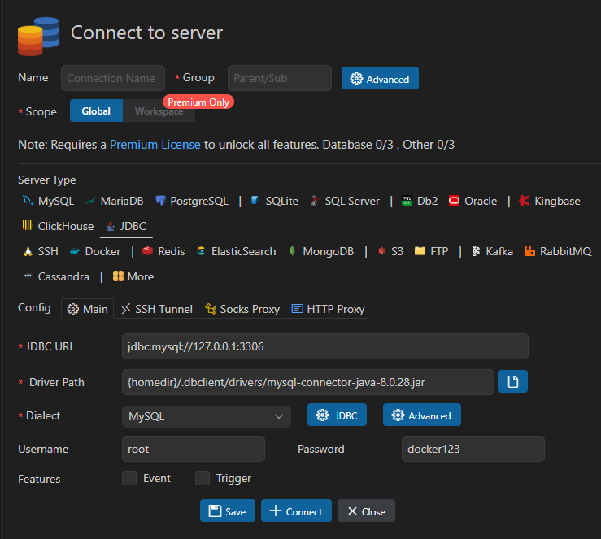
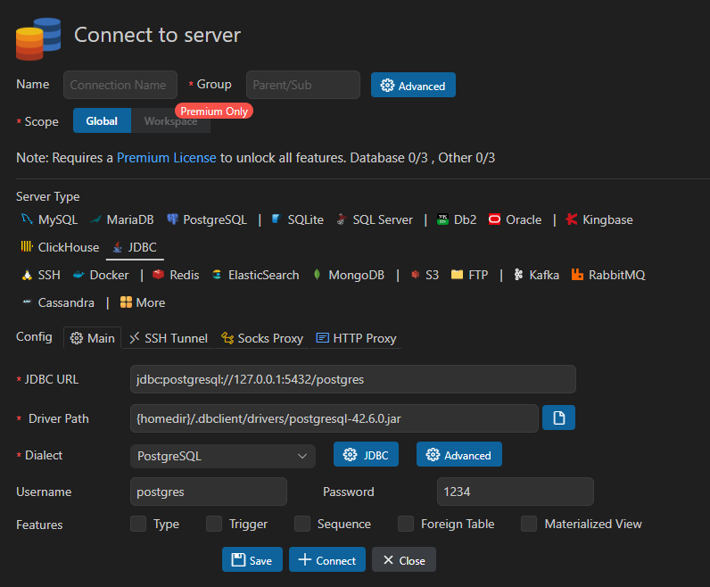
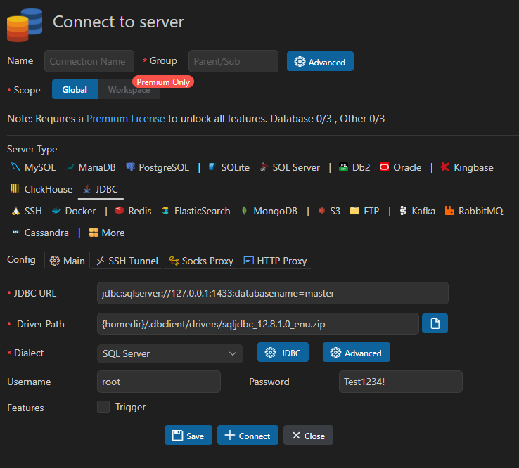
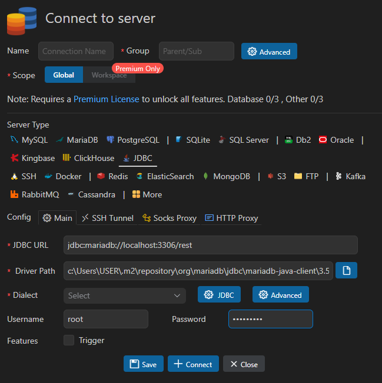

# sample-rest-basic

# 📑 목차

1. [**프로젝트 생성**](#1-프로젝트-생성)
2. [**Maven 프로젝트 + Docker 컨테이너 실행**](#2-maven-프로젝트--docker-컨테이너-실행)
3. [**Maven 프로젝트 + Docker 컨테이너 종료**](#3-maven-프로젝트--docker-컨테이너-종료docker-composeyml-사용하는-경우)
4. [**VSCode Database확장으로 DB 연결하기**](#4-vscode-database확장으로-db-연결하기)
5. [**Maven 프로젝트 + Docker 컨테이너 실행 + Test만 실행**](#5-maven-프로젝트--docker-컨테이너-실행-Test만-실행)

---

## 1. 프로젝트 생성

1. `Visual Studio Code` 실행

2. `Ctrl`+`Shift`+`P` 입력

3. `Spring Initializr: Create a Maven Project` 클릭

4. 계속 엔터

5. `dependencies` 선택
    - Lombok
    - Rest Repositories
    - HyperSQL Database SQL
    - Spring Data JPA

---

## 2. Maven 프로젝트 + Docker 컨테이너 실행 

1. `docker Desktop` 실행

2. 터미널에서 Docker 실행 (**버전은 이미지 마다 다를 수 있음.**)

**MySQL**
```bash
# 이미지 다운로드
docker pull mysql:9.5.0

# 컨테이너 실행
# --name: 컨테이너 이름
# -p: 포트 매핑 (호스트:컨테이너)
# -e: 환경변수 설정
# -v: 볼륨 마운트 (호스트 경로:컨테이너 경로)
# -d: 백그라운드 실행
# 대부분 접속 되지만 접속이 안되는 경우 [allowPublicKeyRetrieval] 옵션을 true로 설정
docker run --name mydata -p 3306:3306 -e MYSQL_ROOT_PASSWORD=docker123 -v C:/Users/USER/Documents/dockerdata/mysqldata:/var/lib/mysql -d mysql:9.5.0
```

**PostgreSQL**
```bash
# 이미지 다운로드
docker pull postgres:latest

# 컨테이너 실행 (postgres 버전 <= 17)
# --name: 컨테이너 이름
# -p: 포트 매핑 (호스트:컨테이너)
# -e: 환경변수 설정
# -v: 볼륨 마운트 (호스트 경로:컨테이너 경로)
# -d: 백그라운드 실행
docker run --name postgres-db -p 5432:5432 -e POSTGRES_PASSWORD=1234 -e POSTGRES_DB=rest -v C:/Users/USER/Documents/dockerdata/postgres:/var/lib/postgresql/data -d postgres:latest

# 컨테이너 실행 (postgres 버전 >= 18)
# 볼륨 마운트 경로가 다름
docker run --name postgres -p 5432:5432 -e POSTGRES_PASSWORD=1234 -v C:/Users/USER/Documents/dockerdata/postgres:/var/lib/postgresql -d postgres:latest
``` 

**MSSQL**
```bash
# 이미지 다운로드
docker pull mcr.microsoft.com/mssql/server:2025-latest

# 컨테이너 실행 (기본 설정)
docker run --name mssql2025 -p 1433:1433 -e "ACCEPT_EULA=Y" -e "MSSQL_SA_PASSWORD=Test1234!" -v C:/Users/USER/Documents/dockerdata/mssql:/var/opt/mssql/data -d mcr.microsoft.com/mssql/server:2022-latest
```

**MariaDb**
```bash
# 이미지 다운로드 
docker pull mariadb:noble

# 컨테이너 실행
docker run --name maria -p 3306:3306 -v C:/Users/USER/Documents/dockerdata/maria:/var/lib/mysql:Z -e MARIADB_ROOT_PASSWORD=Test1234! -d mariadb:latest
```

3. 터미널에서 Spring Boot 애플리케이션 실행
```bash
# test 폴더에서는 '>' 화살표 클릭과 동일함.
.\mvnw spring-boot:run
```

---

## 3. Maven 프로젝트 + Docker 컨테이너 종료(docker-compose.yml 사용하는 경우)
```bash
docker-compose down 
```

---


## 4. VSCode **Database**확장으로 DB 연결하기

**Mysql**
1. JDBC URL : `jdbc:mysql://127.0.0.1:3306`
2. Dialect : `MySQL`
3. Driver Path : `{homedir}/.dbclient/drivers/mysql-connector-java-8.0.28.jar` => 2번 선택 시 자동 입력
4. Username : `root`
5. Password : `Docker Container`에서 지정한 비밀번호



---


**PostgresSQL**
1. JDBC URL : `jdbc:postgresql://127.0.0.1:5432/postgres`
2. Dialect : `PostgresSQL`
3. Driver Path : `{homedir}/.dbclient/drivers/postgresql-42.6.0.jar` => 2번 선택 시 자동 입력
4. Username : `postgres`(postgres의 기본 Username)
5. Password : `Docker Container`에서 지정한 비밀번호`



- Connect to server Error 트러블슈팅 목록
Error 메시지 PSQLException: password authentication failed for user "postgres"
- 해결방안 순서
```bash
# 1.  postgre 실행 시 이미 컨테이너에 존재한다고 하면 삭제하는 명령어 그리고 다시 위의 run 명령어로 실행하면 됨.
# docker rm -f postgres
# docker run --name postgres -p 5432:5432 -e POSTGRES_PASSWORD=1234 -d postgres:latest

# 2. 그럼에도 같은 문제인 경우 체크 
- Driver Path 경로에 .jar 존재하는지 확인 
- 위의 password 1234 다시 설정했음에도 틀렸다고 나오는지 확인
- 포트충돌인지 확인하기 
- 최종적인 문제는 Windows에 PostgreSQL18 이 도커 컨테이너로 설치 전 별도로 설치되어 있었고,해당 서비스가 5432포트를 먼저 점유하고 있던 상황 `매번 PC를 켰을 때 Enable 상태였던 것`
- VSCode는 Docker 컨테이너가 아닌 로컬 PostgreSQL 18에 연결을 시도했고, 비밀번호가 달라 인증 실패가 반복된 것. 
PID	프로세스	역할
8064	postgres.exe	Windows 로컬 설치 PostgreSQL 18 (포트 선점)
9592	com.docker.backend.exe	Docker Desktop
```
### 해결 과정 (단계별 명령어)
STEP 1. 기존 컨테이너 및 볼륨 초기화
CMD / PowerShell (관리자)
```bash
docker rm -f postgres
docker volume prune -f
```
STEP 2. PostgreSQL 16으로 컨테이너 실행
postgres:latest (v18)는 볼륨 마운트 경로가 변경되어 충돌 발생 → postgres:16 사용
CMD / PowerShell
```bash
docker run --name postgres -p 5432:5432 -e POSTGRES_PASSWORD=1234 -d postgres:16
```
STEP 3. 컨테이너 정상 실행 확인
CMD / PowerShell
```bash
docker ps
# 확인 결과: STATUS가 "Up" 상태인지 확인
```
STEP 4. 포트 충돌 확인
5432 포트를 점유 중인 프로세스가 2개 발견됨
CMD / PowerShell
```bash
netstat -ano | findstr :5432
#출력 결과에서 PID 확인 후 프로세스 이름 조회:
tasklist | findstr "8064"
tasklist | findstr "9592"
#결과: postgres.exe (로컬 PostgreSQL 18)와 Docker가 동시에 5432 점유 중임을 확인
```
STEP 5. 로컬 PostgreSQL 서비스 중지
서비스 이름 확인:
PowerShell (관리자 권한 필요)
```bash
sc query type= all | findstr -i "postgres"
# 서비스 중지:
net stop "postgresql-x64-18"
# ⚠️  PowerShell에서 sc 명령어 오류 시 sc.exe 로 실행
sc.exe config "postgresql-x64-18" start= disabled
```
STEP 6. VSCode에서 연결 성공 확인
로컬 PostgreSQL 서비스 중지 후 VSCode DB 클라이언트에서 Connect → 연결 성공 (343ms)


### VSCode DB 클라이언트 최종 설정값
설정 항목	값
Server Type	JDBC
JDBC URL	jdbc:postgresql://127.0.0.1:5432/postgres
Driver Path	{homedir}/.dbclient/drivers/postgresql-42.7.5.jar
Dialect	PostgreSQL
Username	postgres
Password	1234
SSH Tunnel	비활성화 (OFF)

### Spring Boot application.properties 설정
spring.jpa.properties.hibernate.dialect=org.hibernate.dialect.PostgreSQLDialect
spring.datasource.driver-class-name=org.postgresql.Driver
spring.datasource.url=jdbc:postgresql://localhost:5432/postgres
spring.datasource.username=postgres
spring.datasource.password=1234

### 재발 방지
PC 재시작 시 로컬 PostgreSQL 18이 자동으로 켜지는 것을 방지:
PowerShell (관리자 권한)
```bash
sc.exe config "postgresql-x64-18" start= disabled
```
Docker 컨테이너 수동 시작 (자동 시작 설정하지 않은 경우):
CMD / PowerShell
```bash
docker start postgres
```
---

**MSSQL**
1. JDBC URL : `jdbc:sqlserver://127.0.0.1:1433;databasename=master`
2. Dialect : `SQL Server`
3. Driver Path : `{homedir}/.dbclient/drivers/sqljdbc_12.8.1.0_enu.zip`
4. Username: `지정한 username`
5. Password : `Docker Container`에서 지정한 비밀번호



---

**MariaDB**
1. JDBC URL : `jdbc:mariadb://localhost:3306/rest`
2. Dialect : `선택안해도 됨.`
3. Driver Path : `c:\Users\USER\.m2\repository\org\mariadb\jdbc\mariadb-java-client\3.5.7\mariadb-java-client-3.5.7.jar`
4. Username: `root`
5. Password : `Docker Container`에서 지정한 비밀번호



---


## 5. Maven 프로젝트 + Docker 컨테이너 실행 + Test만 실행

1. `docker Desktop` 실행 가정하에

2. 터미널에서 Maven프로젝트 실행 명령어 정리 

현재 프로젝트에 DemoApplicationTests.java가 있으니 ./mvnw test 실행하면 해당 테스트가 돌아갑니다.
./mvnw test
```bash
./mvnw spring-boot:run # 애플리케이션 실행 
./mvnw test # test만 실행 
./mvnw package           # 빌드 (테스트 포함)
./mvnw package -DskipTests  # 테스트 건너뛰고 빌드
```

3. Test 출력 결과에 따른 설명 
# contextLoads1() — Repository 테스트

# helloRepository.save(hello)로 "유비샘" 데이터 저장
# 로그에서 insert into example_hello 쿼리가 실행된 것으로 확인

# contextLoads2() — 웹 요청 테스트

# POST /helloes → Status 201 (Created) 성공
# GET /helloes → Status 200 + Body에 저장된 데이터 2건 반환 성공

# 그리고 최종 결과:
# Tests run: 2, Failures: 0, Errors: 0, Skipped: 0
# BUILD SUCCESS
# 한 가지 주목할 점은 테스트가 HSQLDB (인메모리 DB) 로 실행됐다는 겁니다:
# HikariPool-1 - Added connection org.hsqldb.jdbc.JDBCConnection
# Database version: 2.7.3
# test/resources/application.properties가 별도로 설정되어 있어서 실제 Docker PostgreSQL이 아닌 인메모리 DB로 테스트가 돌아간 것입니다. 테스트마다 DB가 초기화되므로 의도된 정상적인 동작입니다.
